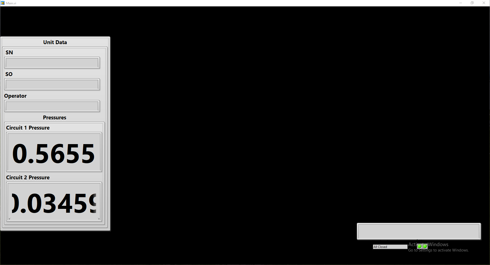
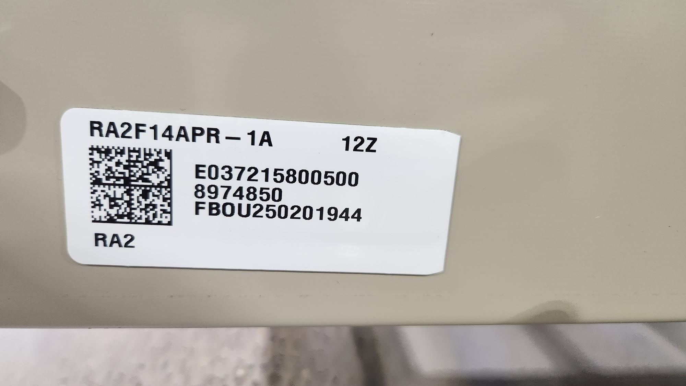
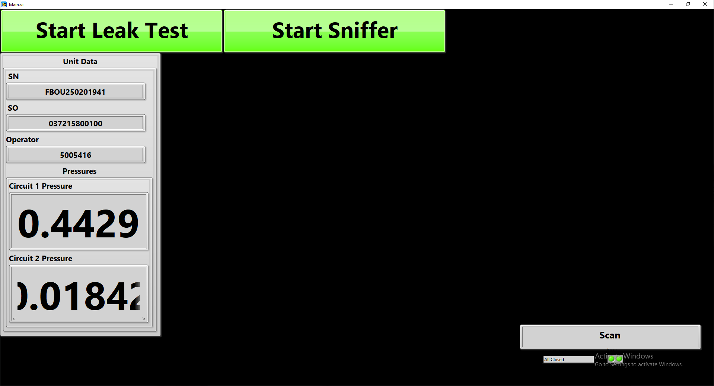
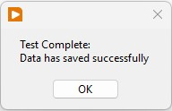
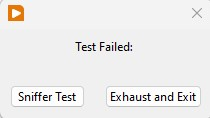

# Decay Test Procedure

This document outlines the steps for performing a decay test on Daikin HVAC units. The decay test checks for leaks in refrigerant circuits by pressurizing the unit, monitoring pressure decay, and performing a sniffer test.

---

## 1. Equipment & Hose Setup

1. **Gas Fill Hose** → Connect to the **discharge** service port.  
2. **Pressure Transducer Hose** → Connect to the **suction** service port.  
3. **Safety Guards** → Install around all exposed copper piping.

---

## 2. Launching the Test App

- If the app is not already running, double-click **Main.exe** on the desktop.  
- The home screen will appear:  
  

---

## 3. Scan Unit & Operator

1. **Scan AMS Barcode**  
     
   – Fills in unit information on the home screen.

2. **Scan Operator Badge**  
   – Populates the **Operator** field.  
   – Once both fields are filled, **Start Leak Test** and **Start Sniffer Test** buttons appear.

   

---

## 4. Full Test Sequence

Click **Start Leak Test** to run the full decay test sequence:

1. **Circuit Fill & Cross-Circuit Check**  
   - Circuits fill one at a time to 50 psi.  
   - If circuit 2 pressure rises while circuit 1 is filling → **Error: Cross-circuited** → Test aborts.

2. **30s Short Decay Test**  
   - All circuits held at 50 psi.  
   - Monitors for large leaks over 30 s.

3. **High-Pressure Fill**  
   - Pressurize **all** circuits together to ~240 psi (± 5 psi).

4. **5 min Stabilization**  
   - Let the pressure stabilize for 5 minutes.

5. **5 min Decay Test**  
   - Monitor pressure drop over 5 minutes.  
   - **Data acquisition:** 200 readings/sec per transducer → low-pass filter → average.  
   - **Pass criteria:** Pressure loss ≤ 0.2–0.4 psi over 5 minutes.

6. **Sniffer (Leak Detection) Test**
   - **Reduce Pressure** → Pressures are lowered on all circuits to 50 psi (± 5 psi).  
   - **Remove Guards** (50 psi is now safe).  
   - **Activate Sniffer Test** → Click **Start Sniffer**.  
   - **Inspect Joints & Components**
   - Walk around unit with sniffer probe.  
   - Software graphs ppm readings in real time.

5. **Complete Sniffer Test**  
   - Click **Sniffer Test Complete** when no leaks detected.  
   - Software turns on the pump and evacuates to ~0 psi (or specified lower pressure).

---

## 6. Test Completion

- A “Test Complete” pop-up appears when data is successfully saved to AMS:  
    
- Click **OK** → Screen resets to blank, ready for next unit.  
- **Tear down:**  
  - Disconnect hoses.  
  - Remove and store guards.  
  - Move unit out of the test area.  

---

## 7. Leak Detected Handling

If a leak is detected during a decay test, the software will display a pop-up dialog:

> **Leak Detected**  

1. **Exhaust System**  
   - Clicking **Exhaust and Exit** will safely bleed down all circuits to 0psi.  
   - Once exhausted, repair or replace the faulty component, then reconnect and restart the decay test sequence.

2. **Perform Sniffer Test**  
   - Clicking **Perform Sniffer Test** will hold all circuits at **50 psi (± 5 psi)**.  
   - Remove the safety guards and walk the unit with a sniffer probe to pinpoint the leak location.  
   - The software will graph ppm readings in real time during this leak‐location pass.  
   - After repair, click **Sniffer Test Complete** and the system will exhaust to allow retesting.

