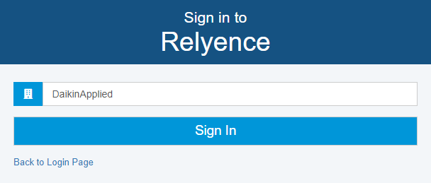
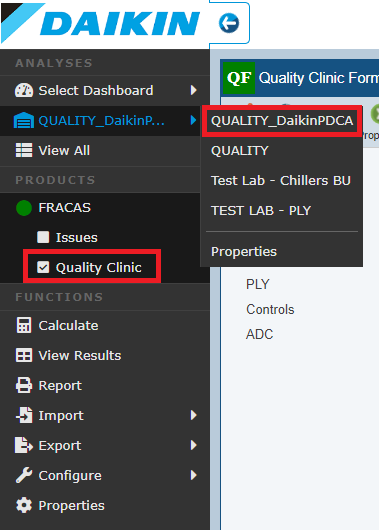
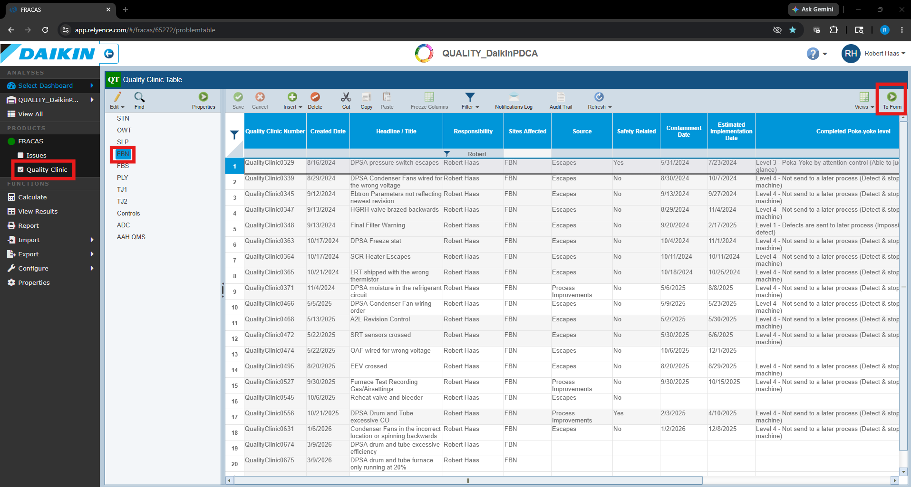
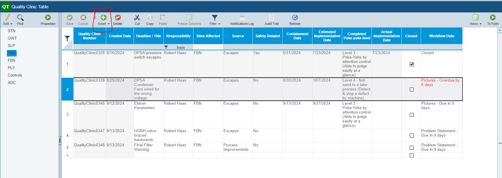
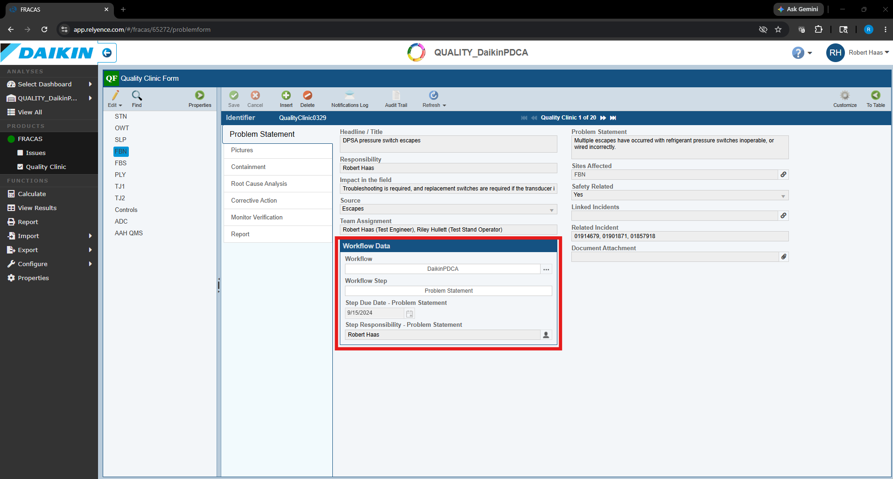

# FRACAS Guide

This guide explains how to access FRACAS, create a PDCA, and complete each tab using a consistent quality-clinic approach. The goal is to make the PDCA useful for solving problems, not just documenting them.

The **Problem Statement** is the most important part of the quality clinic. If the problem is not clearly defined and quantified, the root cause analysis and corrective actions will usually become vague or ineffective.

## Table of Contents

- [Accessing FRACAS](#accessing-fracas)
- [Navigating to the PDCA Template](#navigating-to-the-pdca-template)
- [Creating a New PDCA](#creating-a-new-pdca)
- [Filling Out the PDCA Tabs](#filling-out-the-pdca-tabs)
  - [1. Problem Statement](#1-problem-statement-detailed-instructions)
  - [2. Pictures](#2-pictures)
  - [3. Containment](#3-containment-detailed-instructions)
  - [4. Root Cause Analysis](#4-root-cause-analysis-detailed-instructions)
  - [5. Corrective Action](#5-corrective-action-detailed-instructions)
  - [6. Monitor Verification](#6-monitor-verification-detailed-instructions)
- [PowerPoint Reporting Guide for PDCA](#powerpoint-reporting-guide-for-pdca)

---

## Accessing FRACAS

1. **Login with SSO**
   - Navigate to the [FRACAS](https://app.relyence.com/Account/Login?ReturnUrl=%2F) login page.
   - Use Single Sign-On (SSO).
   - Make sure the network is set as **DaikinApplied**.

   

2. **Network Access**
   - Ensure you are connected to the **DaikinApplied** network to access FRACAS.

3. **Requesting FRACAS Access**
   - New users requiring FRACAS access or licenses should send a request to:
     - Dheeraj Sheth — Dheeraj.Sheth@daikinapplied.com
   - Include:
     - Name
     - Site
     - Department
     - Reason access is required
---

## Navigating to the PDCA Template

1. **Locate the PDCA Template**
   - On the left side of the screen, find the navigation tree.
   - Go to **Quality -> Quality_DaikinPDCA**.
   - Select **Quality Clinic** not **Issues**

   

2. **Access the PDCA Table**
   - Clicking on **Quality_DaikinPDCA** opens a table view of all PDCA entries.
   - Select **Qaulity Clinic** and your work site
   

---

## Creating a New PDCA

1. **Insert a New PDCA**
   - At the top of the table, click the **Insert** button to create a new PDCA entry.

   

2. **Open the New PDCA Entry**
   - Clicking the **To Form** button on the top right of the table opens the quality clinic.

---

## Filling Out the PDCA Tabs

After opening the new PDCA entry, complete the tabs in order. Most fields should be filled out unless they are clearly not applicable.

- Each tab includes a workflow section, which defaults to the required time to complete the section.
- When completed work on that section select the **Next Step** button to complete that section and move to the next.

### Workflow and Approval Expectations

Each major phase of the PDCA workflow includes a review and approval step.

The workflow image above shows the expected routing and approval process for each section.

The following phases require Quality review before moving forward:

- Root Cause Analysis
- Corrective Action Plan
- Effectiveness Verification / Closure

The purpose of these reviews is to ensure:

- The problem statement is clearly defined and quantified
- Root causes are supported by evidence
- Corrective actions address both occurrence and escape
- Corrective actions are validated
- Monitoring plans are appropriate before closure

These reviews are intended to improve the quality and rigor of the PDCA process and should not be treated as an administrative formality.
---

## 1. Problem Statement Detailed Instructions

The **Problem Statement** tab is the foundation of the PDCA. This section must clearly define the problem, quantify the impact, identify the scope, and explain why the issue matters.

A strong problem statement should answer:

- What failed?
- Where was it found?
- How often has it happened?
- What is the business impact?
- What is the customer or field impact?
- What sites or products may be affected?
- What data supports the concern?

A weak problem statement leads to weak containment, weak root cause analysis, and weak corrective action.

---

### Problem Statement Best Practice

A good problem statement should include as many of the following as possible:

- Number of TRC cases
- Number of warranty cases
- Warranty dollar amount
- Turnback quantity
- Production time lost
- Scrap or rework impact
- Affected models
- Affected serial number range
- Date range of occurrence
- Customer or field impact
- Detection point
- Escape point

#### Good Problem Statement Example

> 12 TRC cases and 4 warranty claims were identified on DPSA units with intermittent pressure switch failures between January and March 2024. Warranty exposure is currently estimated at $18,500. Production experienced 37 turnbacks resulting in approximately 22 labor hours lost. Failures were identified at FBN, with similar product configurations also produced at SLP and FBS. Field failures resulted in troubleshooting visits and component replacement.

#### Weak Problem Statement Example

> Pressure switches are failing.

The weak example does not explain quantity, impact, site scope, customer impact, or business risk.

---

### Headline / Title

- **Description**: Enter a short, descriptive headline summarizing the issue.
- **Example**: `DPSA pressure switch escapes`
- **Purpose**: Allows anyone viewing the PDCA to quickly understand the general issue.

---

### Responsibility

- **Description**: Enter the name of the person responsible for driving the PDCA to completion.
- **Example**: `Robert Haas`
- **Purpose**: Assigns clear ownership.

---

### Impact in the Field

- **Description**: Describe the real-world impact of the issue.
- **Example**: `Field troubleshooting and component replacement are required when the pressure switch does not operate correctly.`
- **Purpose**: Explains how the problem affects customers, service, warranty, or unit operation.

---

### Source

- **Description**: Indicate the source of the issue.
- **Examples**:
  - `TRC`
  - `Warranty`
  - `Turnback`
  - `Audit`
  - `Field escape`
  - `Customer complaint`
- **Purpose**: Helps categorize where the issue was identified.

---

### Team Assignment

- **Description**: List the individuals or teams assigned to the PDCA and their roles.
- **Example**: `Robert Haas (Test Engineer), Riley Hullett (Test Stand Operator), Quality Engineer, Production Supervisor`
- **Purpose**: Identifies the cross-functional team responsible for investigation and resolution.

---

### Workflow

- **Description**: Select the appropriate workflow for the PDCA entry.
- **Example**: `DaikinPDCA`
- **Purpose**: Ensures the PDCA follows the correct review and approval process.

---

### Problem Statement

- **Description**: Provide a detailed explanation of the issue using measurable data.
- **Purpose**: This is the core of the PDCA.

The problem statement should not jump directly to the suspected cause or solution. It should define the problem clearly enough that another person can understand the issue without additional explanation.

---

### Sites Affected

- **Description**: List all factories or facilities affected by the issue. This is not limited to the site where the PDCA is being created.
- **Example**: `FBN, SLP, FBS`
- **Purpose**: Identifies where containment and corrective actions may need to be deployed.

Example:

> If the issue was discovered at FBN, but the same process, product, or fix also affects SLP and FBS, list all three sites.

---

### Safety Related

- **Description**: Specify whether the issue is safety related.
- **Example**: `Yes`
- **Purpose**: Safety-related problems must be handled with appropriate urgency and visibility.

---

### Linked Incidents

- **Description**: Provide related incident numbers.
- **Example**: `01914679, 01901871, 01857918`
- **Purpose**: Allows cross-reference to related issues, TRCs, warranty claims, or previous investigations.

---

### Related Incident

- **Description**: Enter related incident numbers if applicable.
- **Example**: `01914679, 01901871, 01857918`
- **Purpose**: Provides traceability to related documented problems.

---

### Document Attachment

- **Description**: Attach relevant supporting information.
- **Examples**:
  - Pictures
  - Test data
  - Warranty data
  - TRC reports
  - Audit results
  - Field reports
  - RCCA documents
- **Purpose**: Provides evidence to support the problem statement.

---

## 2. Pictures

Upload images that help explain the problem or current condition.

Good pictures should show:

- Failed condition
- Correct condition
- Affected component
- Serial label or identifying marker
- Tooling involved
- Test setup
- Location of the issue on the unit
- Before and after condition if available

Pictures should make the problem easier to understand without requiring a long verbal explanation.

---

## 3. Containment Detailed Instructions

The **Containment** section documents immediate actions taken to prevent additional defects or escapes while root cause analysis and corrective actions are being completed.

Containment should consider:

- Current production
- Work in process
- Finished goods
- Units in transit
- Units already shipped
- Field exposure
- Other affected facilities

Containment must identify whether field escapes are expected. If field escapes are possible, document the estimated quantity and the identifying marker used to determine affected units.

---

### Containment Date

- **Description**: Enter the date containment was implemented or is planned.
- **Example**: `5/31/2024`
- **Purpose**: Establishes when the immediate protection was put in place.

---

### Containment

- **Description**: Describe the immediate actions taken to prevent additional issues.
- **Purpose**: Defines how the issue is being controlled until permanent corrective actions are completed.

A good containment statement should include:

- What action was taken
- Who is responsible
- What units are included
- How effectiveness is verified
- Whether field escapes are expected
- Quantity of potentially affected field units
- Serial number range or identifying marker
- Whether other sites were notified

#### Good Containment Example

> Implemented 100% functional verification of pressure switch operation at all final test stations. Operators are required to simulate switch activation and verify the expected MCB response. Approximately 42 units produced between serial ranges XXXX–XXXX may contain the issue and are being reviewed. No additional field escapes are currently expected after containment implementation. FBN, SLP, and FBS were notified because the same product configuration may be produced at each site.

#### Weak Containment Example

> Operators were told to check switches.

The weak example does not explain how the check is performed, what units are included, who owns it, how effectiveness is verified, or whether field escapes are expected.

---

### Containment Reporting

- This field is automatically populated based on the containment section.

---

## 4. Root Cause Analysis Detailed Instructions

The **Root Cause Analysis** section identifies the true causes of the problem. Root cause analysis should not stop at the first obvious explanation. The goal is to understand why the issue occurred and why the existing system allowed it to escape.

Best practice is to use a **fishbone analysis** and **5 Why analysis** together.

The fishbone helps identify possible causes across multiple categories. The 5 Why helps dig deeper into the real systemic causes.

Root cause analysis should be completed with a cross-functional team, which may include:

- TRC
- Production
- Quality
- Manufacturing Engineering
- Design Engineering
- Test Engineering
- Maintenance
- Supplier Quality, if applicable

---

### Problem Solving Methodology

- **Description**: Select or describe the methodology used.
- **Example**: `Fishbone and 5 Why`
- **Purpose**: Records the problem-solving approach used during the investigation.

---

### Problem Solving Tool

- **Description**: Attach supporting documentation used during analysis.
- **Example**: `RCCA_pressure_switch.xlsx`
- **Purpose**: Provides traceability to the fishbone, 5 Why, and supporting investigation.

Use the `RCCA_template.xlsx` document to start the analysis.

---

### Preliminary Confirmed Root Cause

- **Description**: Enter the confirmed or preliminary root causes identified through analysis.
- **Purpose**: Documents the specific causes that must be addressed by corrective actions.

Root causes should be:

- Specific
- Clear
- System-focused
- Actionable
- Supported by evidence

Avoid root causes that only blame the operator. If operator action contributed to the issue, continue asking why the system allowed the error.

#### Good Preliminary Confirmed Root Cause Examples

- `Assembly was completed using the incorrect wire stripping tool, damaging conductor strands.`
- `The correct stripping tool was not available in the operator work area.`
- `PFMEA did not identify the failure mode of the wrong stripping tool being used because the process steps were defined at a high level.`
- `Final test did not consistently detect this issue because the electrical contact was intermittent, with the wire making contact during some test cycles.`

#### Weak Root Cause Example

- `Operator error.`

This is weak because it does not identify the process, tooling, training, PFMEA, or detection-system failure that allowed the error to occur.

---

### Preliminary Confirmed Root Cause Reporting

- This field is automatically populated by the previous table.

---

### Best Practices for Root Cause Analysis

#### Fishbone Analysis

A fishbone diagram should be used to brainstorm possible causes before deciding on the confirmed root cause.

Common categories include:

- Man
- Machine
- Method
- Material
- Measurement
- Environment

The fishbone should be completed with input from multiple departments so the team does not overlook process, test, tooling, or design contributors.

Use the [RCCA_template.xlsx](../templates/RCCA_template.xlsx) to document the fishbone diagram and attach it under **Problem Solving Tool**.

---

#### 5 Why Analysis

After completing the fishbone analysis, use 5 Why to drill deeper into the most likely causes.

The 5 Why should include multiple branches when needed. A strong RCCA usually investigates:

- Why the defect occurred
- Why the defect escaped detection
- Why the system allowed the issue to continue

Do not stop the 5 Why at operator action. Continue until the team identifies the process weakness, tooling weakness, documentation gap, training gap, detection gap, or control-plan weakness.

---

#### RCCA Template

Use the [RCCA_template.xlsx](../templates/RCCA_template.xlsx) located in the templates folder.

Attach the completed RCCA template to the **Problem Solving Tool** section.

---

## 5. Corrective Action Detailed Instructions

The **Corrective Action** section documents the actions that will eliminate or reduce the root causes and prevent recurrence.

Corrective actions should address:

- All of the root causes
- The cause of the defect
- The cause of the escape
- The weakness in the control system
- Any affected sites
- Any affected documentation
- Training or deployment requirements

Corrective actions should be stronger than retraining whenever possible.

---

### Corrective Action Hierarchy

Corrective actions should be prioritized in this order:

1. Eliminate the failure mode
2. Add poka-yoke or error-proofing
3. Add automated detection
4. Improve process controls
5. Improve standard work or documentation
6. Train or communicate awareness only

Training alone is usually a weak corrective action unless paired with a stronger process or detection improvement.

---

### Action

- **Description**: Document each corrective or containment action.
- **Examples**:
  - `Add dedicated stripping tool to the operator work area.`
  - `Update PFMEA to include incorrect stripping tool as a potential failure mode.`
  - `Update final test to detect intermittent electrical contact.`
  - `Add visual standard showing correct and incorrect stripped wire condition.`
- **Purpose**: Defines the work required to prevent recurrence.

---

### Owner

- **Description**: Assign the individual responsible for completing the action.
- **Example**: `Robert Haas`
- **Purpose**: Creates accountability.

---

### Due Date

- **Description**: Set a deadline for completing each action.
- **Example**: `6/28/2024`
- **Purpose**: Ensures actions are completed in a timely manner.

---

### Complete

- **Description**: Mark whether the action is complete.
- **Example**: `Yes`
- **Purpose**: Tracks status.

---

### Action Type

- **Description**: Identify the type of action.
- **Examples**:
  - `Containment`
  - `Corrective Action`
  - `Documentation Update`
  - `Training`
  - `Poka-Yoke`
  - `Validation`
- **Purpose**: Categorizes the action.

---

### Report Out

- **Description**: Use this checkbox if the action needs to be reported to stakeholders.
- **Purpose**: Ensures important actions are communicated.

---

### Typical Corrective / Countermeasure Actions

The following actions should be considered:

- Implement containment
- Identify root cause
- Identify all related failure modes
- Work with the team to identify possible solutions
- Select the strongest practical corrective action
- Validate the corrective action
- Deploy changes to all affected sites
- Train affected personnel
- Update documentation
- Update PFMEA
- Update control plans
- Update test procedures
- Update work instructions
- Update repositories or standards

---

### Corrective Action Validation

Corrective actions should include validation evidence.

Examples of validation evidence:

- Test results
- Audit results
- Before/after defect data
- Production trial results
- Gage or fixture verification
- Updated PFMEA
- Updated control plan
- Updated standard work
- Training records

A corrective action should not be considered complete only because a change was made. It should be considered complete when there is evidence that the change works.

---

### Current Poka-Yoke Level

- **Description**: Select the current level of mistake-proofing.
- **Example**: `Level 2 - Detectable by human judgment`
- **Purpose**: Shows the starting level of process protection.

Poka-yoke levels are described in detail in the `RCCA_template.xlsx` document.

---

### Completed Poka-Yoke Level

- **Description**: Select the improved poka-yoke level after corrective actions are implemented.
- **Example**: `Level 3 - Poka-Yoke by attention control`
- **Purpose**: Shows how the corrective action improved process robustness.

---

### Estimated Implementation Date

- **Description**: Enter the estimated completion date for all corrective actions.
- **Example**: `7/23/2024`
- **Purpose**: Establishes the expected completion date for implementation.

---

### Is This Problem Likely to Occur at Other Facilities?

- **Description**: Indicate whether the issue may exist at other facilities.
- **Example**: `Yes`
- **Purpose**: Ensures the team considers shared processes, products, suppliers, tooling, and test methods.

---

### Who Needs to Be Notified at Other Facilities?

- **Description**: List the people or teams that need to be notified.
- **Example**: `FBN Quality, SLP Production, FBS Manufacturing Engineering`
- **Purpose**: Ensures cross-site communication and deployment.

---

### Lessons Learned

- **Description**: Summarize what was learned from the investigation.
- **Purpose**: Captures knowledge that can prevent future issues.

Good lessons learned may include:

- Process weaknesses discovered
- Controls that were missing
- PFMEA improvements needed
- Detection improvements needed
- Training gaps
- Design or tooling considerations
- Standards that should be updated

---

## 6. Monitor Verification Detailed Instructions

The **Monitor Verification** section tracks whether the corrective actions remain effective over time.

This section should confirm:

- The original failure mode no longer occurs
- Similar failures are not appearing elsewhere
- The detection system remains effective
- The corrective action is sustainable
- Containment can be safely removed

---

### Actual Implementation Date

- **Description**: Enter the date corrective actions were fully implemented.
- **Example**: `7/23/2024`
- **Purpose**: Defines when monitoring begins.

---

### Verification of Effectiveness Duration

- **Description**: Enter the monitoring duration in months.
- **Example**: `24`
- **Purpose**: Defines how long the issue will be monitored.

---

### Recommended Monitoring Metrics

Use measurable data whenever possible:

- TRC quantity
- Warranty claims
- Warranty dollars
- Turnbacks
- Scrap
- Rework
- Downtime
- Audit findings
- Escape rate
- First-pass yield

The monitoring data should show whether the corrective action is effective over time.

---

### Event Data Issue Found After Closed

This section is used to log any related events found after the PDCA is closed.

Each event should include:

- Event date
- Source
- Comments
- Relationship to original issue
- Whether additional action is required

This information supports Elephant Chart reporting and helps determine whether the corrective action was truly effective.

---

## PowerPoint Reporting Guide for PDCA

Until FRACAS automates the reporting process, manually create PowerPoint reports using the **PDCA Reporting Template**.

Copy and paste the following fields from FRACAS into the report:

1. **Problem Statement**  
   Copy from the Problem Statement section.

2. **Impact**  
   Copy from the impact fields in FRACAS.

3. **Field Impact**  
   Include related incident numbers, warranty impact, and field exposure.

4. **Problem Solving Methodologies**  
   Copy the methodology used, such as Fishbone and 5 Why.

5. **Preliminary or Confirmed Root Cause**  
   Copy from the Root Cause Analysis section.

6. **Corrective Action**  
   Copy corrective actions from FRACAS.

7. **Containment**  
   Copy containment actions from FRACAS.

8. **Countermeasures**  
   Summarize the permanent countermeasures.

9. **RCCA Open Actions**  
   Copy any open actions.

10. **Poka-Yoke**  
   Copy the current and completed poka-yoke levels.

---

## Final Review Checklist

Before submitting or reporting a PDCA, confirm the following:

- [ ] Problem statement is quantified.
- [ ] TRC, warranty, and turnback data were included when available.
- [ ] Sites affected were reviewed across all relevant factories.
- [ ] Containment addresses factory and field exposure.
- [ ] Field escape quantity and identifying markers were documented if applicable.
- [ ] Fishbone and 5 Why were used together.
- [ ] Root causes are system-focused and not simply operator blame.
- [ ] Corrective actions address both occurrence and escape.
- [ ] PFMEA, control plans, work instructions, or tests were updated if needed.
- [ ] Validation evidence is attached.
- [ ] Monitoring metrics are defined.
